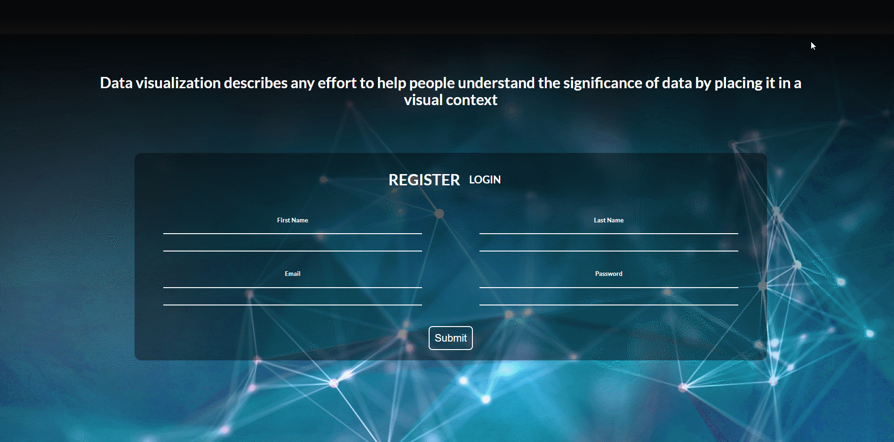
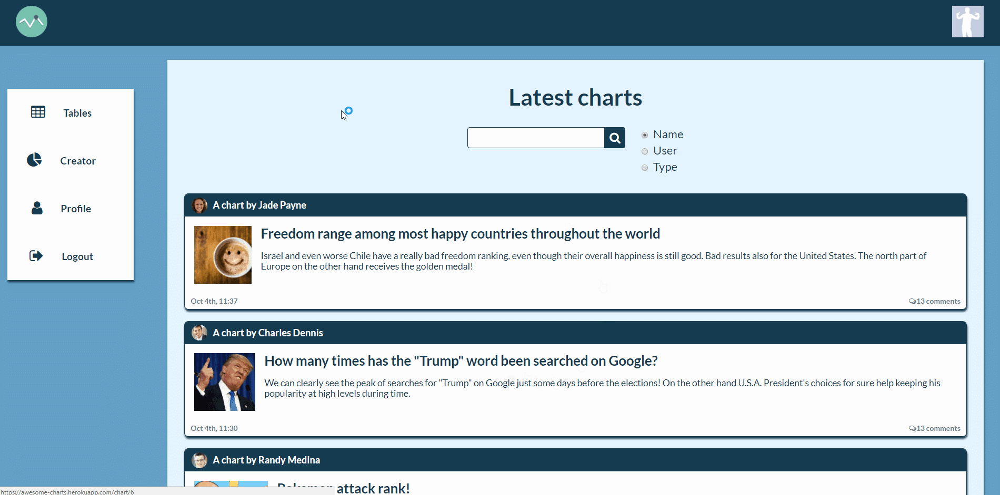
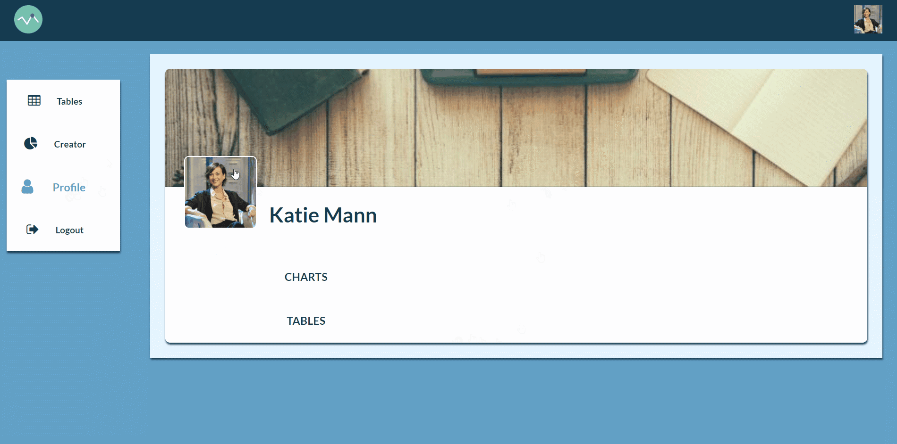
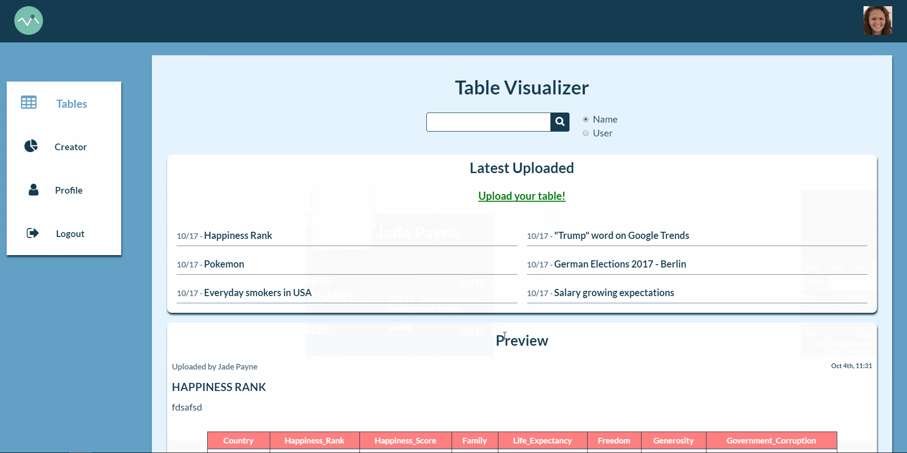
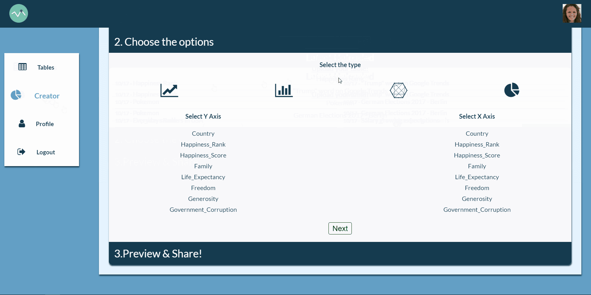
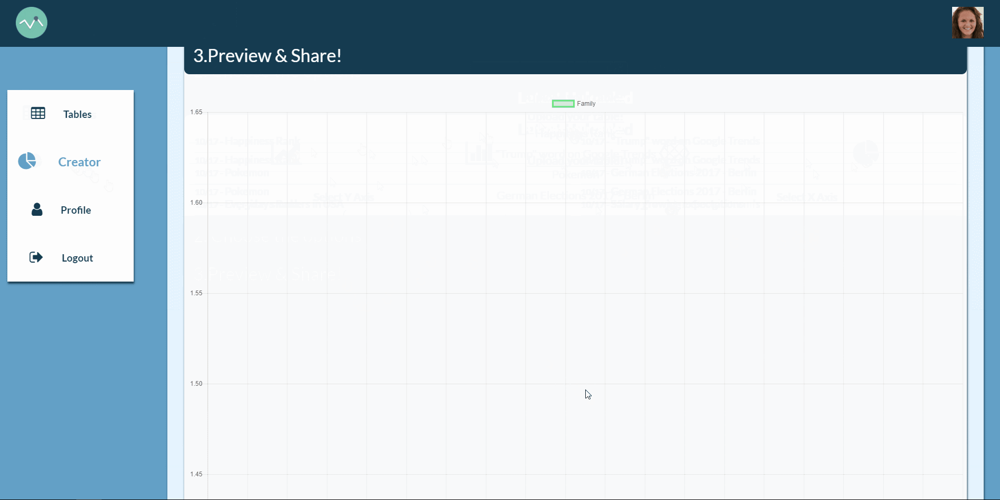
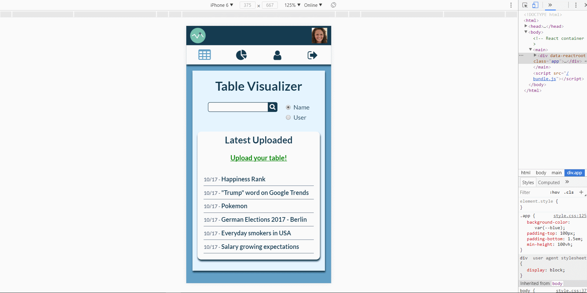

# Awesome Charts

### Table of contents

*   [Website](#website)
*   [Overview](#overview)
*   [Description](#description)
*   [Details](#details)

### Website

[Awesome Charts](https://awesome-charts.herokuapp.com/)

### Overview

This app has been my final project at SPICED Academy.
We were allowed one week to come up with any JS application of our choosing. 
My idea was simple: make row/ugly table data accessible to the vast majority of non-specialized people, in the most simple and fun way. 
A ton of row data is available online for free, but it can become hard to read and understand.
If people can instead simply upload 'csv' files (a very common format for tables) and easily create charts using those tables,
then data visualization will be simple as a game. 
If users can also access to other's data and charts to make their own researches, that game becomes awesome.
 
 
Technologies used:
*   React JS
*   Redux
*   Express
*   PostgreSQL
*   AWS S3

### Description

Registration and Login are required. Passwords are hashed and salted server side before being saved into database, and CSRF protection is included in all forms.

 
 

Once you log in, you can access to your profile page, and upload a new profile picture. 
On 'Profile' you can also take a look at your uploaded tables and your published charts.

 
 

Say you wanna upload a '*.csv' table (you can easily download one of your choice or create it using Google Sheets).
To do so, just click on 'Tables' icon on the left and upload it from your file system. 
Once uploaded on AWS S3, you can preview the first 4 rows of that table: it's useful to know the kind of data you wanna deal with.

 
 

Now let's create our chart, so click on 'Creator' icon. 
First step is to select the table you wanna work with. Users have access to all uploaded tables. 
If you don't find the table of your choice in the rendered list, just search for it using the search field.

 
 

Second step is selecting the table columns you wanna display on your chart, and select the type of chart between 'bar', 'line', 'radar' or 'pie'.
You can play with them till you achieve your result.

 
 

Final step is previewing your new chart, give it name & description, a self-explanatory image (so then it looks nicer for other users to see), and Share it. 
If you don't like your chart-preview, you can still step back and modify some parameters.

 
 

Your table has now been published, and you can find it on the main page among the other latest published charts. 
Clicking on a card will display the chart full screen, so you can analize it better. 
Users can also post comments on charts.

 
 

### Details

The application makes a strong use of Redux for maintaining the overall state. 
I really like the way a React + Redux application are structured, they become really easy to maintain and also easy for other developers to get into. 
Also, all my ajax call to the server has been made via Redux actions, to then it's simple to debug server-side issues.
 
 
No CSS frameworks have been used for this project, just a ton of CSS, and the final result is really good. 
The app is totally responsive. Obviously big charts become quite difficult to display on small screens, but there's not really a solution to it.

 
 
Server-side I implemented an Express JS server. Data is spit into 4 different tables on a POSTGRESQL database. 
AWS S3 service is used for storing images and tables. 
Tables are uploaded as 'csv' files. To deal with them I use the 'csvtojson' npm package, that allow me to get JSON data out of a '*.csv' file, and serve it to the front-end app.
